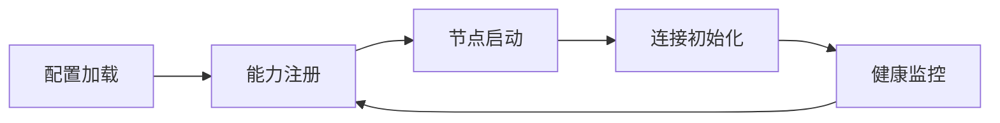

# Galaxy - 快速上手指南

## 🎯 系统概览 (Round 2 - R-4)

Galaxy 是一个 **L4 级自主性智能系统**，集成了：

- ✨ **能力注册与发现** (OpenClaw 风格) - 统一能力索引和调度
- 🔗 **稳定连接管理** (向日葵风格) - 心跳保活、自动重连
- 🏗️ **完整系统群型架构** - 贯穿启动→注册→通信→监控的闭环

### 核心流程


```mermaid
graph LR
    A[配置加载] --> B[能力注册]
    B --> C[节点启动]
    C --> D[连接初始化]
    D --> E[健康监控]
    E --> B
```

---

## 🚀 一键启动

### 方式 1: Docker Compose (推荐)

```bash
# 1. 克隆仓库
git clone https://github.com/DannyFish-11/galaxy-realization.git
cd galaxy-realization

# 2. 一键启动
docker-compose up -d

# 3. 查看状态
docker-compose ps
```

### 方式 2: 本地安装

```bash
# 1. 克隆仓库
git clone https://github.com/DannyFish-11/galaxy-realization.git
cd galaxy-realization

# 2. 安装依赖
pip install -r requirements.txt

# 3. 启动系统
python -m launcher start --groups core

# 4. 查看状态
python -m launcher status
```

## 📱 手机跨设备联通

### Android App 配置

1. **下载 APK**
   ```bash
   # 从 GitHub Releases 下载
   wget https://github.com/DannyFish-11/galaxy-android/releases/latest/download/app-release.apk
   ```

2. **配置服务器地址**
   - 打开 App → Settings
   - 输入服务器地址: `ws://your-server-ip:8080`
   - 点击 Connect

3. **授权设备**
   - 在服务器端确认设备注册
   - 设备将自动同步

### 自然语言控制

从手机发送语音/文字命令:

```
"打开客厅的灯"                    → 控制智能家居
"让无人机起飞到10米"              → 控制无人机
"开始打印文件test.gcode"          → 控制3D打印机
"截图保存"                        → 控制浏览器
"发送邮件给xxx说你好"              → 发送邮件
"创建一个明天下午3点的会议"        → 创建日程
```

## 🎯 支持的设备和平台

| 平台/设备 | 节点ID | 示例命令 |
|-----------|--------|----------|
| **iOS** | Node_26 | "打开iPhone上的微信" |
| **Android** | Node_33 | "连接Android设备" |
| **Windows** | Node_36 | "点击Windows上的按钮" |
| **macOS** | Node_35 | "执行AppleScript" |
| **Linux** | Node_37 | "执行Linux命令" |
| **智能家居** | Node_27 | "打开客厅的灯" |
| **无人机** | Node_43 | "让无人机起飞" |
| **3D打印机** | Node_49 | "开始打印文件" |
| **浏览器** | Node_98 | "打开网站example.com" |
| **邮件** | Node_16 | "发送邮件" |
| **日历** | Node_23 | "创建日程" |
| **GitHub** | Node_11 | "列出仓库" |
| **量子计算** | Node_51 | "提交量子任务" |

## 🔧 常用命令

### 节点管理

```bash
# 启动所有核心节点
python -m launcher start --groups core

# 启动特定节点
python -m launcher start --nodes 26 27 43

# 查看节点状态
python -m launcher status

# 停止所有节点
python -m launcher stop
```

### 自然语言执行

```python
from enhancements.nlu.unified_nlu import NLUCommandExecutor

executor = NLUCommandExecutor(gateway)

# 从任意节点执行自然语言命令
result = await executor.execute_text("打开客厅的灯")
```

### 跨节点通信

```python
from core.node_communication import wakeup_node, execute_command

# 从服务器唤醒Android设备
await wakeup_node("server_01", "android_01", "new_task")

# 从Android控制服务器
await execute_command("android_01", "server_50", "process_data", args=["data"])

# 节点自激活
await activate_self("server_01", "restart_service")
```

## 🌐 Web 控制台

启动后访问:
- **控制台**: http://localhost:3000 (Grafana)
- **API 文档**: http://localhost:8080/docs
- **节点状态**: http://localhost:8080/status

## 📊 监控面板

```bash
# 查看日志
docker-compose logs -f

# 查看指标
curl http://localhost:9090/metrics

# 查看节点健康
curl http://localhost:8080/health
```

## 🔐 安全配置

```bash
# 设置 API Key
export GALAXY_API_KEY="your-secret-key"

# 配置 JWT Secret
export JWT_SECRET="your-jwt-secret"

# 启用 HTTPS
export GALAXY_HTTPS_ENABLED=true
export GALAXY_SSL_CERT=/path/to/cert.pem
export GALAXY_SSL_KEY=/path/to/key.pem
```

## 🐛 故障排查

### 常见问题

1. **节点无法启动**
   ```bash
   # 检查日志
   python -m launcher status
   
   # 重启节点
   python -m launcher restart --nodes <node_id>
   ```

2. **Android 无法连接**
   ```bash
   # 检查网络
   ping your-server-ip
   
   # 检查防火墙
   sudo ufw allow 8080
   ```

3. **自然语言识别失败**
   ```bash
   # 测试 NLU
   python enhancements/nlu/unified_nlu.py
   ```

## 📚 更多文档

- [完整文档](docs/README.md)
- [API 参考](docs/API.md)
- [节点开发指南](docs/NODE_DEVELOPMENT.md)
- [部署指南](docs/DEPLOYMENT.md)
- [能力注册系统](docs/CAPABILITY_SYSTEM.md)

## 🔧 能力注册与连接管理 (New in R-4)

### 验证系统状态

```bash
# 验证能力注册系统
python scripts/verify_capability_registry.py

# 运行集成测试
python tests/test_capability_integration.py
```

### 能力查询

系统启动后，能力信息保存在 `config/capabilities.json`：

```json
{
  "version": "1.0.0",
  "capabilities": [
    {
      "name": "http_get",
      "description": "HTTP GET 请求",
      "node_id": "08",
      "node_name": "Fetch",
      "category": "http",
      "status": "online"
    }
  ]
}
```

### 连接状态

连接信息保存在 `config/connection_state.json`：

```json
{
  "timestamp": "2026-02-11T08:00:00",
  "connections": [
    {
      "connection_id": "node_08",
      "url": "http://localhost:8008",
      "state": "connected",
      "last_heartbeat": "2026-02-11T08:00:30"
    }
  ]
}
```

### 健康监控集成

健康监控现在包括能力和连接状态：

```bash
# 查看完整系统状态
python system_manager.py status
```

输出包括：
- 节点健康状态
- 能力在线/离线统计
- 连接状态和重连次数

## 💬 获取帮助

- GitHub Issues: https://github.com/DannyFish-11/galaxy-realization/issues
- Discord: https://discord.gg/galaxy

---

**现在你可以从手机控制所有设备了！** 🎉
