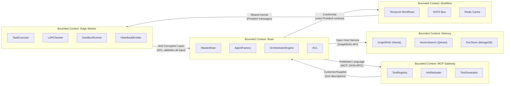
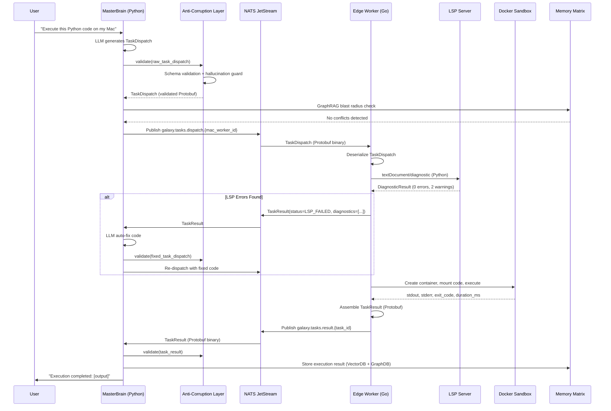
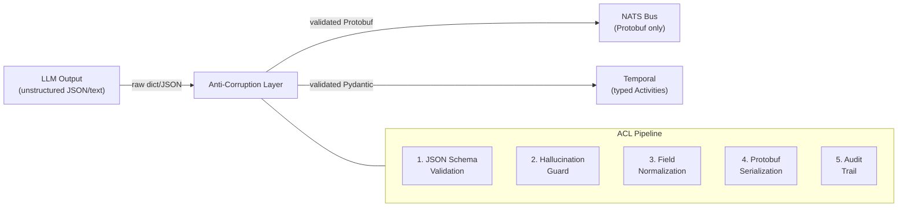

# Distributed Agentic OS - Global Domain Topology & Context Mapping

**Version**: 1.0.0
**Date**: 2026-03-10
**Status**: Phase 1 — Contract Locked

---

## 1. System Architecture Topology (High-Resolution)

```mermaid
graph TB
    subgraph USER_INTERFACE["Layer 1: Multi-Modal User Interface"]
        UI_TEXT["Text/Chat"]
        UI_VOICE["Voice (TTS/STT)"]
        UI_VISION["Vision/Camera"]
        UI_WEB["Web Dashboard"]
        UI_ANDROID["Android Client"]
    end

    subgraph CONTROL_PLANE["CONTROL PLANE (Cloud/Hub — Python)"]
        subgraph MASTER_BRAIN["Master Brain (Orchestrator)"]
            LLM_ROUTER["LLM Router<br/>(OneAPI: GPT/Claude/Gemini/DeepSeek/Ollama)"]
            ACL["Anti-Corruption Layer<br/>(Schema Validation + Hallucination Guard)"]
            AGENT_FACTORY["Agent Factory<br/>(Template/LLM-Gen/Self-Replicating)"]
            ORCHESTRATOR["Orchestrator Engine<br/>(110 Node Dispatch)"]
        end

        subgraph WORKFLOW_ENGINE["Workflow & Messaging"]
            TEMPORAL["Temporal.io<br/>(Durable Workflows:<br/>CodeExec / MultiDevice / ToolDiscovery)"]
            NATS["NATS JetStream<br/>(Pub/Sub + Task Queues:<br/>galaxy.tasks.* / galaxy.events.*)"]
            REDIS["Redis<br/>(Cache + Legacy Pub/Sub)"]
        end

        subgraph MEMORY_MATRIX["Three-Dimensional Memory Matrix"]
            NEO4J["Neo4j (GraphDB)<br/>Logical Anti-Corruption Graph<br/>+ GraphRAG Blast Radius Analysis"]
            QDRANT["Qdrant/Milvus (VectorDB)<br/>Experience Skill Library<br/>+ Semantic Search"]
            MONGO["MongoDB (DocStore)<br/>Session History<br/>+ Agent State Snapshots"]
        end

        subgraph MCP_GATEWAY["MCP Dynamic Gateway"]
            MCP_REGISTRY["Tool Registry<br/>(JSON-RPC 2.0)"]
            MCP_HOTLOAD["Hot-Reload Engine<br/>(Self-Tool-Making)"]
            MCP_BRIDGE["Multi-Language Bridge<br/>(Node.js/Go/Rust/Java)"]
        end
    end

    subgraph DATA_PLANE["DATA PLANE (Edge Workers — Go/Rust)"]
        subgraph WORKER_DESKTOP["Desktop Worker (Go)"]
            W1_NATS["NATS Subscriber"]
            W1_LSP["LSP Probe<br/>(pylsp/gopls/tsserver)"]
            W1_SANDBOX["Docker/Firecracker Sandbox"]
            W1_FS["Local Filesystem Ops"]
        end

        subgraph WORKER_MOBILE["Mobile Worker (Go + ADB)"]
            W2_NATS["NATS Subscriber"]
            W2_ADB["ADB Bridge"]
            W2_SCREEN["Screen Capture"]
            W2_INPUT["Input Injection"]
        end

        subgraph WORKER_IOT["IoT/Embedded Worker (Rust — Future)"]
            W3_NATS["NATS Subscriber"]
            W3_SERIAL["Serial/CAN/BLE"]
            W3_SENSOR["Sensor Fusion"]
            W3_MAVLINK["MAVLink (Drone)"]
        end
    end

    subgraph INFRA["Infrastructure Services"]
        MINIO["MinIO (Object Storage)"]
        OLLAMA["Ollama (Local LLM)"]
        ONEAPI["OneAPI Gateway"]
        COTURN["CoTURN (WebRTC TURN)"]
    end

    %% ── Data Flow: User → Brain ──
    UI_TEXT --> LLM_ROUTER
    UI_VOICE --> LLM_ROUTER
    UI_VISION --> LLM_ROUTER
    UI_WEB --> LLM_ROUTER
    UI_ANDROID --> LLM_ROUTER

    %% ── Brain Internal Flow ──
    LLM_ROUTER -->|"raw LLM output"| ACL
    ACL -->|"validated Protobuf"| ORCHESTRATOR
    ACL -->|"validated Protobuf"| TEMPORAL
    ORCHESTRATOR --> AGENT_FACTORY
    AGENT_FACTORY --> ORCHESTRATOR

    %% ── Brain → Workflow ──
    ORCHESTRATOR -->|"TaskDispatch (proto)"| NATS
    TEMPORAL -->|"Activity: publish task"| NATS
    TEMPORAL <-->|"Workflow state"| REDIS

    %% ── Brain → Memory ──
    ORCHESTRATOR <-->|"GraphRAG query"| NEO4J
    ORCHESTRATOR <-->|"Semantic search"| QDRANT
    ORCHESTRATOR <-->|"State persistence"| MONGO

    %% ── Brain → MCP ──
    ORCHESTRATOR <-->|"tool_call / tool_result"| MCP_REGISTRY
    MCP_HOTLOAD -->|"register new tool"| MCP_REGISTRY
    MCP_REGISTRY --> MCP_BRIDGE

    %% ── NATS → Workers (Protobuf over NATS) ──
    NATS -->|"TaskDispatch<br/>(galaxy.tasks.dispatch.{wid})"| W1_NATS
    NATS -->|"TaskDispatch<br/>(galaxy.tasks.dispatch.{wid})"| W2_NATS
    NATS -->|"TaskDispatch<br/>(galaxy.tasks.dispatch.{wid})"| W3_NATS

    %% ── Worker Internal Flow ──
    W1_NATS --> W1_LSP
    W1_LSP -->|"diagnostics pass"| W1_SANDBOX
    W1_SANDBOX --> W1_FS
    W2_NATS --> W2_ADB
    W2_ADB --> W2_SCREEN
    W2_ADB --> W2_INPUT
    W3_NATS --> W3_SERIAL
    W3_NATS --> W3_SENSOR

    %% ── Workers → Brain (Results) ──
    W1_NATS -->|"TaskResult<br/>(galaxy.tasks.result.{tid})"| NATS
    W2_NATS -->|"TaskResult<br/>(galaxy.tasks.result.{tid})"| NATS
    W3_NATS -->|"TaskResult<br/>(galaxy.tasks.result.{tid})"| NATS

    %% ── Worker Heartbeat ──
    W1_NATS -.->|"Heartbeat<br/>(galaxy.workers.heartbeat)"| NATS
    W2_NATS -.->|"Heartbeat"| NATS
    W3_NATS -.->|"Heartbeat"| NATS

    %% ── Infrastructure Links ──
    LLM_ROUTER --> ONEAPI
    LLM_ROUTER --> OLLAMA
    W1_SANDBOX --> MINIO
    UI_ANDROID --> COTURN

    %% ── Styling ──
    classDef brain fill:#4a90d9,stroke:#2c5f8a,color:#fff
    classDef workflow fill:#f5a623,stroke:#c47d1a,color:#fff
    classDef memory fill:#7ed321,stroke:#5ca118,color:#fff
    classDef mcp fill:#9b59b6,stroke:#7d3c98,color:#fff
    classDef worker fill:#e74c3c,stroke:#c0392b,color:#fff
    classDef infra fill:#95a5a6,stroke:#7f8c8d,color:#fff
    classDef ui fill:#1abc9c,stroke:#16a085,color:#fff

    class LLM_ROUTER,ACL,AGENT_FACTORY,ORCHESTRATOR brain
    class TEMPORAL,NATS,REDIS workflow
    class NEO4J,QDRANT,MONGO memory
    class MCP_REGISTRY,MCP_HOTLOAD,MCP_BRIDGE mcp
    class W1_NATS,W1_LSP,W1_SANDBOX,W1_FS,W2_NATS,W2_ADB,W2_SCREEN,W2_INPUT,W3_NATS,W3_SERIAL,W3_SENSOR,W3_MAVLINK worker
    class MINIO,OLLAMA,ONEAPI,COTURN infra
    class UI_TEXT,UI_VOICE,UI_VISION,UI_WEB,UI_ANDROID ui
```

---

## 2. Domain Context Map (Bounded Contexts)

---

## 3. NATS Subject Topology

| Subject Pattern | Direction | Payload (Protobuf) | Delivery |
|---|---|---|---|
| `galaxy.tasks.dispatch.{worker_id}` | Brain → Worker | `TaskDispatch` | JetStream (at-least-once) |
| `galaxy.tasks.result.{task_id}` | Worker → Brain | `TaskResult` | JetStream (at-least-once) |
| `galaxy.workers.heartbeat` | Worker → Brain | `WorkerHeartbeat` | Core NATS (best-effort) |
| `galaxy.workers.register` | Worker → Brain | `WorkerRegistration` | JetStream (at-least-once) |
| `galaxy.mcp.calls` | Brain → MCP GW | `MCPCallRequest` | JetStream (at-least-once) |
| `galaxy.mcp.results` | MCP GW → Brain | `MCPCallResponse` | JetStream (at-least-once) |
| `galaxy.mcp.register` | MCP GW → Brain | `MCPToolRegistration` | JetStream (at-least-once) |
| `galaxy.events.{type}` | Any → Any | `AgentEvent` | Core NATS (fan-out) |

---

## 4. Temporal Workflow Definitions

| Workflow | Trigger | Activities | Compensation |
|---|---|---|---|
| `CodeExecutionWorkflow` | User/Agent code request | 1. ACL validate → 2. NATS dispatch to worker → 3. LSP pre-check → 4. Sandbox execute → 5. Result collect | Retry with fix on LSP failure; kill sandbox on timeout |
| `MultiDeviceTaskWorkflow` | Cross-device command | 1. Resolve target workers → 2. Fan-out tasks via NATS → 3. Aggregate results → 4. Reconcile conflicts | Compensate partial completions; rollback device state |
| `ToolDiscoveryWorkflow` | Capability gap detected | 1. Generate tool code via LLM → 2. ACL validate → 3. Sandbox test → 4. MCP register → 5. Broadcast capability | Remove failed tool registration |
| `SelfHealWorkflow` | Health check failure | 1. Diagnose via 5-Whys → 2. Generate fix → 3. LSP check → 4. Sandbox verify → 5. Apply → 6. Monitor | Rollback to last known good state |

---

## 5. Data Flow Sequence (Code Execution — Full Lifecycle)

---

## 6. Anti-Corruption Layer (ACL) Position

The ACL intercepts ALL boundaries:
- **Brain → NATS**: LLM-generated task dispatches validated before publishing
- **Worker → Brain**: Worker results validated before feeding back to LLM
- **MCP → Brain**: External tool results sanitized before consumption
- **User → Brain**: User input validated at API boundary (existing FastAPI schemas)
